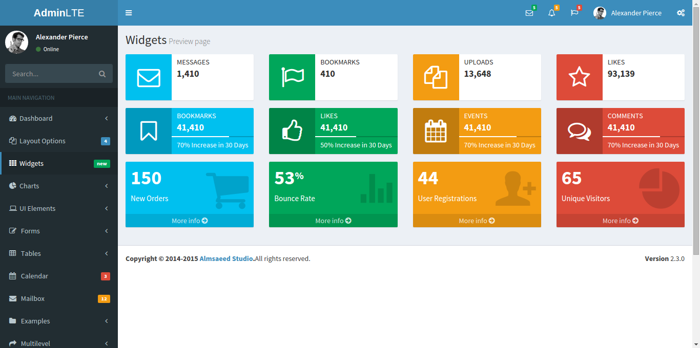

# ReactJS-AdminLTE

ReactJS version of the original AdminLTE dashboard - https://github.com/almasaeed2010/AdminLTE


### UPDATES: 

- [UI Elements](./reactjs-adminlte/public/src/ui-elements) turning up.

     [Click here](http://ec2-52-74-208-196.ap-southeast-1.compute.amazonaws.com:8000/UI/general.html) to see it live


- [ReactJS Timeline](./reactjs-adminlte/public/src/timeline-page)

    [Click here](http://ec2-52-74-208-196.ap-southeast-1.compute.amazonaws.com:8000/timeline.html) to see it live


- [ReactJS Widgets](./reactjs-adminlte/public/src/widgets-page)

    [Click here](http://ec2-52-74-208-196.ap-southeast-1.compute.amazonaws.com:8000/widgets.html) to see a live preview!

    


##### Widgets will use velocity.js animations instead of the originally used JQuery animations wherever possible, for improved performance across all browsers and devices.


[ReactJS Dashboard](./reactjs-adminlte/public/src/dashboardV1)

Will soon be populated with charts.


More stuff coming soon. Stay tuned!


#### Instructions to run

- Fork or clone this repo
- Install nodejs and NPM
- Go to the project folder reactjs-adminlte from your terminal and run `npm install`
- Run `node server.js`
- Going to [http://localhost:8000](http://localhost:8000) will render an empty dashboard skeleton in the client-side using ReactJS. Clicking on one of the dashboard options on the left pane displays the original dashboards from AdminLTE.
- Go to [http://localhost:8000/widgets.html](http://localhost:8000/widgets.html) to see available widgets in ReactJS.
- Use [React Developer Tools Chrome Extension](https://chrome.google.com/webstore/detail/react-developer-tools/fmkadmapgofadopljbjfkapdkoienihi?hl=en) to understand the components hierarchy and structure and to track down bugs.


#### For development

- React Hot Loader can be used to ease your development workflow. This can be done by installing dev dependencies from `package.json` file. If you haven't, then
run `npm install webpack-dev-server` and `npm install react-hot-loader`.
- Then in your HTML, change your javascript bundles' source paths to point to the webpack-dev-server proxy in your `script` tags. So if you have something
like this 

```html
<script src="/dist/js/vendors.js"></script>
<script src="/dist/js/app.bundle.js"></script>
```

change this to 

```html
<script src="http://localhost:8080/dist/js/vendors.js"></script>
<script src="http://localhost:8080/dist/js/app.bundle.js"></script>
```

For a detailed explanation on setting up a workflow using Webpack, check out my blog post - [Webpack for The Fast and The Furious](https://medium.com/@booleanhunter/webpack-for-the-fast-and-the-furious-bf8d3746adbd#.uzx2l0hy4) :-)

This is still a work in progress and will get better over time. Will try and think of more essential features. Looking for feedback and contributions! For any discussions or queries, send an email.

#### Upcoming stuff

- Re-usable chart components
- Command line options to choose between client-side rendering and server-side rendering in ReactJS
- Including D3 / C3 charts 

