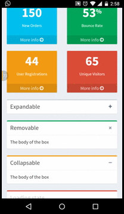
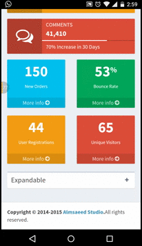

# ReactJS-AdminLTE

ReactJS version of the original AdminLTE dashboard - https://github.com/almasaeed2010/AdminLTE

### UPDATES:

[Widgets created in ReactJS](./reactjs-adminlte/public/widgets)

##### Widgets will use velocity.js animations instead of the originally used JQuery animations wherever possible, for improved performance across all browsers and devices.

- JQuery slideUp/slideDown animation on mobile - 

- With velocity.js, there is a visible performance improvement - 

More stuff coming soon. Stay tuned!

#### Instructions to run

- Fork or clone this repo
- Install nodejs and NPM
- Go to the project folder reactjs-adminlte from your terminal and run npm install
- Run node server.js
- Going to your localhost will render the dashboard in the client-side using ReactJS. Clicking on one of the dashboard options on the left pane displays the original dashboards from AdminLTE.

This is still a work in progress and will get better over time. Will try and think of more essential features.

#### Upcoming stuff

- Re-usable chart components
- Command line options to choose between client-side rendering and server-side rendering in ReactJS
- Including D3 / C3 charts 

