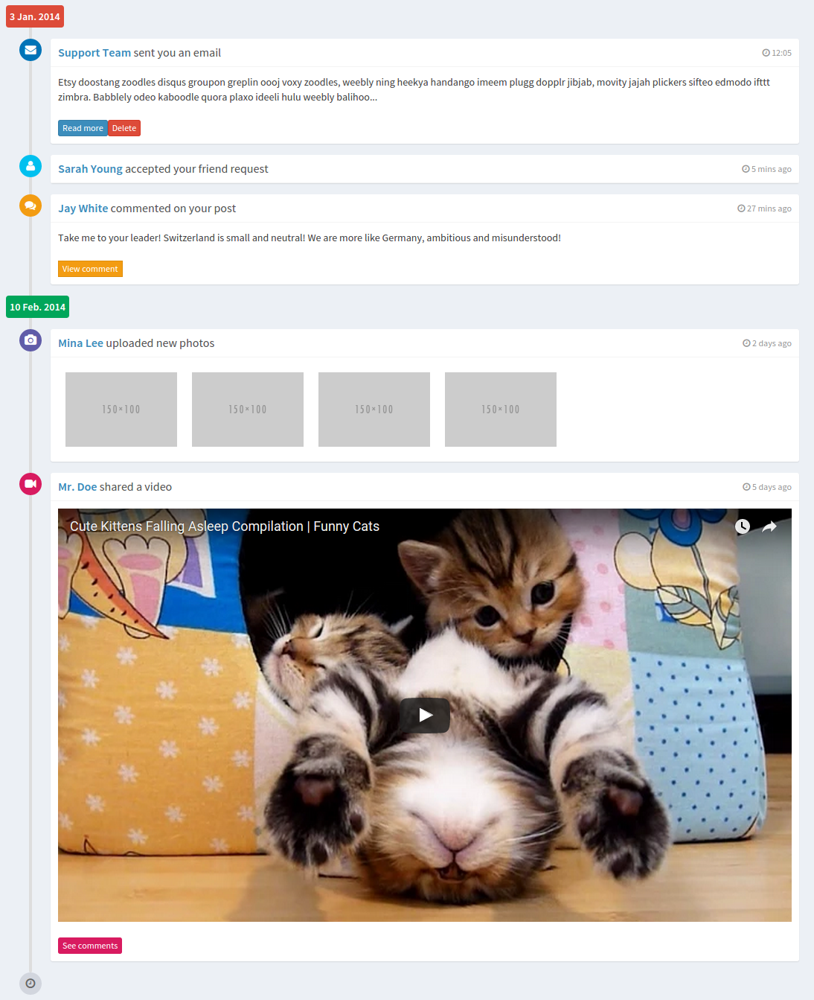

#### [View components](./js/components/timeline)

## List of widgets


### - [Timeline](./js/components/timeline/timeline.js)

The parent component which renders the entire timeline. 

#### Usage:

You have 2 choices - you may either pass data for rendering the timeline via props, or you can pass components [Timelabel](./js/components/timeline/time-label.js) and [TimelineItem](./js/components/timeline/timeline-item/timeline-item.js) as children to Timeline. 

Props: Timeline components takes `timelineInfo`, an array of objects. Each object is of the following structure -

```javascript

startDate: '10 Feb. 2014' (Beginning of one element in the timeline),
endDate: '3 Jan. 2014' (End time of the element in the timeline),
items: Array of objects containing data to be rendered for each individual element in the timeline
[
    {
        icon: 'fa fa-envelope' (Any font-awesome icon as a marker for the timeline element),
        iconTheme: 'bg-blue' (Color of the marker),
        time: ' 12:05' (Date/Time for the element),

        //For each of the option below, you can pass html elements or other component widgets as `markup` to render in each of the sections
        header: (Header section of the item) {
            url: '#',
            title: 'Support Team ',
            content: 'sent you an email'
            markup: (Optional, can be used to pass html) 
        },
        body: (Body of the item) {
            content: 'Etsy doostang zoodles disqus groupon greplin oooj voxy zoodles, weebly ning heekya handango imeem plugg dopplr jibjab, movity jajah plickers sifteo edmodo ifttt zimbra. Babblely odeo kaboodle quora plaxo ideeli hulu weebly balihoo...',
        },
        footer:(Footer section of the item) {
            content: '',
            markup: [
                <a key="1" className="btn btn-primary btn-xs">Read more</a>,
                <a key="2" className="btn btn-danger btn-xs">Delete</a>
            ]
        }
    }
]
```

#### Example: 

```javascript
var timelineInfo = [
    {
        startDate: '10 Feb. 2014',
        endDate: '3 Jan. 2014',
        items: [
            {
                icon: 'fa fa-envelope',
                iconTheme: 'bg-blue',
                time: ' 12:05',
                header: {
                    url: '#',
                    title: 'Support Team ',
                    content: 'sent you an email'
                },
                body: {
                    content: 'Etsy doostang zoodles disqus groupon greplin oooj voxy zoodles, weebly ning heekya handango imeem plugg dopplr jibjab, movity jajah plickers sifteo edmodo ifttt zimbra. Babblely odeo kaboodle quora plaxo ideeli hulu weebly balihoo...',
                },
                footer: {
                    content: '',
                    markup: [
                        <a key="1" className="btn btn-primary btn-xs">Read more</a>,
                        <a key="2" className="btn btn-danger btn-xs">Delete</a>
                    ]
                }
            },
            {
                icon: 'fa fa-user',
                iconTheme: 'bg-aqua',
                time: ' 5 mins ago',
                header: {
                    url: '#',
                    title: 'Sarah Young ',
                    content: 'accepted your friend request'
                }
            },
            {
                icon: 'fa fa-comments',
                iconTheme: 'bg-yellow',
                time: ' 27 mins ago',
                header: {
                    url: '#',
                    title: 'Jay White ',
                    content: 'commented on your post'
                },
                body: {
                    content: 'Take me to your leader! Switzerland is small and neutral! We are more like Germany, ambitious and misunderstood!'
                },
                footer: {
                    content: '',
                    markup: <a className="btn btn-warning btn-flat btn-xs">View comment</a>
                }
            }
        ]
    },{
        items: [
            {
                icon: 'fa fa-camera',
                iconTheme: 'bg-purple',
                time: ' 2 days ago',
                header: {
                    url: '#',
                    title: 'Mina Lee ',
                    content: 'uploaded new photos'
                },
                body: {
                    content: '',
                    markup: [
                        ,
                        ,
                        ,
                        
                    ]
                }
            },
            {
                icon: 'fa fa-video-camera',
                iconTheme: 'bg-maroon',
                time: ' 5 days ago',
                header: {
                    url: '#',
                    title: 'Mr. Doe ',
                    content: 'shared a video'
                },
                body: {
                    content: '',
                    markup: <div className="embed-responsive embed-responsive-16by9">
                        <iframe className="embed-responsive-item" src="https://www.youtube.com/embed/tMWkeBIohBs" frameBorder="0" allowFullScreen="">
                        </iframe>
                    </div>
                },
                footer: {
                    content: '',
                    markup: <a href="#" className="btn btn-xs bg-maroon">See comments</a>
                }
            }
        ]       
    }
];

<Timeline timelineInfo={this.state.timelineInfo}/>
```
