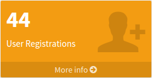
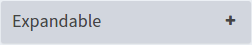
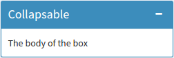
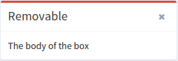
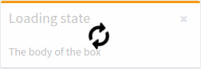
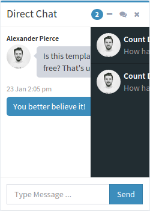
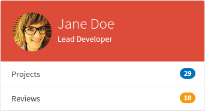
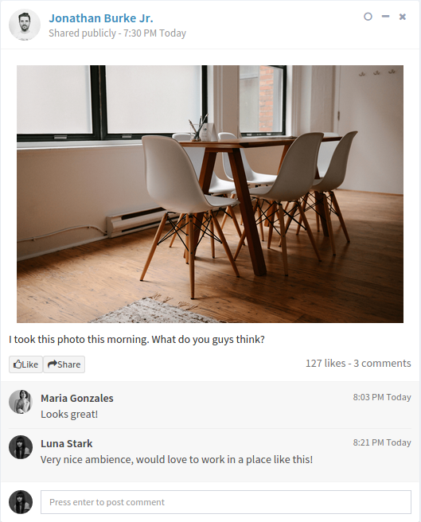
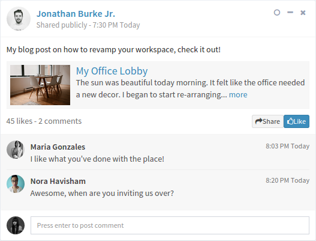

## List of components


### - [InfoTile](./info-tile/info-tile.js)

A basic info-tile for displaying info. 

#### Usage:

Props: This component takes 6 values.

```javascript

width = 3 (Sets the size/width)
theme = 'bg-aqua' / 'bg-green' / 'bg-yellow' (To apply background color to the icon),
icon = 'fa-envelope-o' / 'fa-flag-0' / 'fa-files-0' (Any font-awesome icon)
subject =  'Can be a string or a number'
stats = 'Can be a string or a number'
content = 'Can be a string or a number'
```
#### Example: 

```javascript
<InfoTile  
    width = 3
    content = '' 
    icon = 'fa-envelope-o' 
    stats = '1,410' 
    subject = 'Messages' 
    theme = 'bg-aqua' 
/>
```


You can optionally display a progress status and bar by passing the [ProgressBar](./info-tile/progress-bar.js) component as props.children

```javascript
<InfoTile width = 3 content = '' icon = 'fa-thumbs-o-up' stats = '41,410' subject = 'Likes' theme = 'bg-green' >
	<ProgressBar percent = 50 description = '50% Increase in 30 Days' color = 'white' />
</InfoTile>	
```


### - [StatTile](./stat-tile.js)

A tile for displaying some basic info, highlighting numbers or stats. 

#### Usage:

Props: This component takes 6 values from props, 1 is optional

```javascript
width = 3 (Sets the size/width)
theme = 'bg-aqua' / 'bg-green' / 'bg-red' (To apply background color to the icon),
icon = 'fa-shopping-cart' / 'ion-stats-bars' / 'ion-person-add' (Any font-awesome icon)
subject =  'Can be a string or a number'
stats = 'Can be a string or a number'
link = 'Link to go to for more information'  (Optional)
```
#### Example: 

```javascript
<StatTile 
    width = 3
	theme = 'bg-yellow' 
	icon = 'ion-person-add' 
	subject = 'User Registration' 
	stats = '44'
	link = '#' 
/>
```




### - [Box](./custom-box/box.js)

A customizable box / window for displaying some basic info, to which properties can be applied. Use this to make your own version of a box.

#### Usage:

Props: This component takes 7 values from props, out of which 2 are optional

```javascript
width = 3 (Sets the size/width)
collapsed = true/false (Optional boolean to set initial state of the box. Setting it to true will render a collapsed box, by default this is false)
theme = 'box-default' / 'box-primary' / 'box-warning' / 'box-danger' / 'box-success'
loading = true (Optional boolean value, to show a loading animation)
border = true (Optional boolean value, will apply a border for the box and color for the title bar if true)
title = 'Can be a string or a number'
content = 'Can be a string or a number'
footer = 'Can be a string or a number' (Optional)
boxTools = {['collapse','remove','expand']}  (Optional buttons to make the box expand, collapse or remove upon clicking )
```

#### Examples: 

##### An expandable box with border

```javascript

<Box 
    width = 3
	border = true
	content = 'The body of the box'
	theme = 'box-default'
	title = 'Expandable'
	collapsed = true
    boxTools = ['expand']
/>
```



##### A collapsable box with border

```javascript

<Box 
    width = 3 
	border = true
	content = 'The body of the box'
	theme = 'box-primary'
	title = 'Collapsable'
	collapsed = true
    boxTools = ['collapse']
/>
```



##### A removable box without border

```javascript
<Box 
    width = 3
	content = 'The body of the box'
	theme = 'box-danger'
	title = 'Removable'
    boxTools = ['remove']
/>
```



##### A removable box without border with loading animation

```javascript
<Box 
    width = 3
	content = 'The body of the box'
	theme = 'box-warning'
	loading = true
	title = 'Loading state'
    boxTools = ['collapse']
/>
```




### - [ChatBox](./chat-box/chat-box.js)

A box / window which displays chat messages, notifications and contact information. 

#### Usage:

Props: This component takes 8 values from props to customize it's UI.

```javascript
width = 3 (Sets the size/width)
border = true/false (To display the border)
buttonTheme = 'btn-primary' / 'btn-success' / 'btn-warning' (To apply color for the submit button)
chatTheme = 'direct-chat-primary' / 'direct-chat-success' / 'direct-chat-warning' / 'direct-chat-danger' / {Chat messages color}
headerTheme = 'box-primary' / 'box-success' / 'box-warning' (Chat header / border colors)
notificationTheme = 'bg-light-blue' / 'bg-green' / 'bg-yellow' (Notification color)
notifications = 'Can be a string or a number' (Number of notifications)
title = 'Can be a string or a number'
```

Pass the [Conversations](./chat-box/conversations.js) component as props.children to add chat messages. It accepts an array of objects containing chat information.

```javascript
var conversationsArray = [{
    name: 'John Doe',
    displayPicture: 'url of the image', 
    date: '23 Jan 2:00 pm',
    message: "Is this template really for free? That's unbelievable!"
}]

<Conversations conversations = {conversationsArray} />
```

Pass the [Contacts](./chat-box/contacts.js) component as props.children to add contacts in the right drawer. It accepts an array of objects containing contact information

```javascript
var contactsArray = [{
    name: 'John Doe',
    displayPicture: 'url of the image',
    link: '#',
    date: '2/28/2015',
    message: 'How have you been? I was...',
    align: 'right' // (To align a message to the right)
}]

<Contacts contacts = {contactsArray} />
```

#### Example: 

```javascript

var conversationsInfo = [{
    name: 'Alexander Pierce',
    displayPicture: '../dist/img/user1-128x128.jpg',
    date: '23 Jan 2:00 pm',
    message: "Is this template really for free? That's unbelievable!"
}, {
    align: 'right',
    name: 'Sarah Bullock',
    displayPicture: '../dist/img/user3-128x128.jpg',
    date: '23 Jan 2:05 pm',    
    message: 'You better believe it!'
}];

var contactsInfo = [{
    name: 'Count Dracula',
    displayPicture: '../dist/img/user1-128x128.jpg',
    link: '#',
    date: '2/28/2015',
    message: 'How have you been? I was...'
}, {
    name: 'Count Dracula',
    displayPicture: '../dist/img/user1-128x128.jpg',
    link: '#',
    date: '2/28/2015',
    message: 'How have you been? I was...'
}];

<ChatBox  
    width = 3
    buttonTheme = 'btn-primary'
    chatTheme = 'direct-chat-primary'
    headerTheme = 'box-primary'
    notificationTheme = 'bg-light-blue'
    title = 'Direct Chat'
    notifications = 2 >

    <Conversations conversations = {conversationsInfo} />
    <Contacts contacts = {contactsInfo} />

</ChatBox>
```



### - [ProfileCard](./profile-card/profile-card.js)

A card to display profile information in social media.

#### Usage:

Props: This component takes 7 values from props, 1 is optional

```javascript
width = 3 (Sets the size/width)
theme = 'bg-yellow' / 'bg-aqua-active' / 'bg-red' (Optional, To apply background color),
displayName = 'String'
description = 'String' (Description below the display name)
displayPicture = 'url of the image'
coverPicture = 'url of the image' (Optional cover picture, this will overwrite the theme)
pictureAlignment = 'left' (Display picture is center aligned by default, can be left-aligned)
```

You can choose between [ProfileInfoBlocks](./profile-card/profile-info-blocks.js) component or [ProfileInfoList](./profile-card/profile-info-list.js) component to display additional meta data in the profile card. You have to pass them as props.children.

```javascript
var infoList = [{
    description: 'SALES',
    stats: '3,200'
}, {
    description: 'FOLLOWERS',
    stats: '13,000'
}, {
    description: 'PRODUCTS',
    stats: 35
}];

<ProfileInfoBlocks list={infoList} />

OR

var infoList = [{
    description: 'Projects',
    stats: 10,
    link: '/link/to/info',
    badgeTheme: 'bg-blue'
}, {
    description: 'Tasks',
    stats: 5,
    link: '/link/to/info',
    badgeTheme: 'bg-aqua'
}]

<ProfileInfoList list={infoList} />

```

#### Examples: 

```javascript
var infoList = [{
    description: 'Projects',
    stats: 29,
    link: '#',
    badgeTheme: 'bg-blue'
}, {
    description: 'Reviews',
    stats: 10,
    link: '#',
    badgeTheme: 'bg-yellow'
}];

<ProfileCard 
    width = 3
	theme = 'bg-red'
	displayName = 'Jane Doe'
	description = 'Lead Developer'
	displayPicture = '../dist/img/user7-128x128.jpg'
	pictureAlignment = 'left' >

	<ProfileInfoList list={infoList} />
</ProfileCard>

```


```javascript
var infoList = [{
    description: 'PROJECTS',
    stats: 20
}, {
    description: 'CITIES',
    stats: 11
}, {
    description: 'COUNTRIES',
    stats: 5
}];

<ProfileCard 
    width = 3
	theme = 'bg-aqua'
	displayName = 'John Roe'
	description = 'Founder & CEO'
	displayPicture = '../dist/img/user1-128x128.jpg'
	coverPicture = '../dist/img/photo4.png' >

	<ProfileInfoBlocks list={infoList} />
</ProfileCard>

```


### - [Post](./post/post.js)

A post to b displayed in a news feed page on a social network.

#### Usage:

Props: This component takes 8 values from props.

```javascript
width = 3 (Sets the size/width)
displayName = 'John Doe'
displayPicture = 'url/of/the/image'
date = 'String'
postPicture = 'url/of/the/image' (optional picture embedded in the post)
content = 'String' (Optional content of the post)
attachments =  (An embedded link within the post containing title, image and description)
comments = (Comments on the post)
```

The Post component uses [Comment](./post/comment.js) component to render comments passed from props.comments. It accepts 4 values from props

```javascript
content = 'string' (content of the comment)
displayName = 'Person who commented'
displayPicture = 'url/of/the/image'
date = 'date when commented'
```

Post also uses [Attachment](./post/attachment.js) component to render attachments passed from props.attachments. It takes 4 values from props

```javascript
title = 'string' (title of the attachment)
link = 'url/of/the/link'
picture = 'url/of/the/image'
content = 'content of the attachment'
```

You can use [SocialInfo](./post/social-info.js) component to show additional information, such as likes, shares, views etc. Pass it as children of Post

```javascript
var metaInfo = '50 likes - 10 comments';

<SocialInfo info={metaInfo} />
```

You can use [SocialButton](./post/social-button.js) component to render buttons such as 'like' or 'share'. Pass it as children of Post. It accepts 3 values from props

```javascript
position = 'left'/'right' (optional, which side should the button appear - default is left)
theme = 'btn-default'/ 'btn-primary'/ 'btn-warning'/'btn-aqua' (optional theme, default is 'btn-default')
type = 'like'/'share' (type of the button, default is 'like')

<SocialButton type='share' theme = 'btn-aqua' />
```

#### Examples: 

```javascript
var comments = [
	{
	    displayName: 'Maria Gonzales',
	    displayPicture: '../dist/img/user3-128x128.jpg',
	    date: '8:03 PM Today',
	    content: 'Looks great!',
	}, {
	    displayName: 'Luna Stark',
	    displayPicture: '../dist/img/user4-128x128.jpg',
	    date: '8:21 PM Today',
	    content: 'Very nice ambience, would love to work in a place like this!',
	}
];
<Post 
    width = 3
    displayName = 'Jonathan Burke Jr.'
    displayPicture = '../dist/img/user1-128x128.jpg'
    date = 'Shared publicly - 7:30 PM Today'
    postPicture = '../dist/img/photo2.png'
    content = 'I took this photo this morning. What do you guys think?'
    comments={comments} >

    <SocialButton type = 'like' />
    <SocialButton type = 'share' />
    <SocialInfo info = '127 likes - 3 comments' />
</Post>
```


```javascript
var comments = [
	{
	    displayName: 'Maria Gonzales',
	    displayPicture: '../dist/img/user3-128x128.jpg',
	    date: '8:03 PM Today',
	    content: "I like what you've done with the place!"
	}, {
	    displayName: 'Nora Havisham',
	    displayPicture: '../dist/img/user5-128x128.jpg',
	    date: '8:20 PM Today',
	    content: 'Awesome, when are you inviting us over?'
	}
];

var attachments = [
    {
        title: 'My Office Lobby',
        link: 'http://www.lipsum.com/',
        picture: '../dist/img/photo2.png',
        content: 'The sun was beautiful today morning. It felt like the office needed a new decor. I began to start re-arranging... ' 
    }
];

<Post 
    width = 3
    displayName = 'Jonathan Burke Jr.'
    displayPicture = '../dist/img/user1-128x128.jpg'
    date = 'Shared publicly - 7:30 PM Today'
    postPicture = '../dist/img/photo2.png'
    content = 'My blog post on how to revamp your workspace, check it out!' 
    attachments = {attachments}
    comments = {comments} >

    <SocialButton type = 'like' position = 'right' theme='btn-primary' />
    <SocialButton type = 'share' position = 'right' />
    <SocialInfo info = '45 likes - 2 comments' position ='left'/>

</Post>
```



### - [Timeline](./timeline/timeline.js)

The parent component which renders the entire timeline. 

#### Usage:

You have 2 choices - you may either pass data for rendering the timeline via props, or you can pass components [Timelabel](./timeline/time-label.js) and [TimelineItem](./timeline/timeline-item/timeline-item.js) as children to Timeline. 

Props: Timeline components takes `timelineInfo`, an array of objects. Each object is of the following structure -

```javascript

startDate: '10 Feb. 2014' (Beginning of one element in the timeline),
endDate: '3 Jan. 2014' (End time of the element in the timeline),
items: Array of objects containing data to be rendered for each individual element in the timeline
[
    {
        icon: 'fa fa-envelope' (Any font-awesome icon as a marker for the timeline element),
        iconTheme: 'bg-blue' (Color of the marker),
        time: ' 12:05' (Date/Time for the element),

        //For each of the option below, you can pass html elements or other component widgets as `markup` to render in each of the sections
        header: (Header section of the item) {
            url: '#',
            title: 'Support Team ',
            content: 'sent you an email'
            markup: (Optional, can be used to pass html) 
        },
        body: (Body of the item) {
            content: 'Etsy doostang zoodles disqus groupon greplin oooj voxy zoodles, weebly ning heekya handango imeem plugg dopplr jibjab, movity jajah plickers sifteo edmodo ifttt zimbra. Babblely odeo kaboodle quora plaxo ideeli hulu weebly balihoo...',
        },
        footer:(Footer section of the item) {
            content: '',
            markup: [
                <a key="1" className="btn btn-primary btn-xs">Read more</a>,
                <a key="2" className="btn btn-danger btn-xs">Delete</a>
            ]
        }
    }
]
```

#### Example: 

```javascript
var timelineInfo = [
    {
        startDate: '10 Feb. 2014',
        endDate: '3 Jan. 2014',
        items: [
            {
                icon: 'fa fa-envelope',
                iconTheme: 'bg-blue',
                time: ' 12:05',
                header: {
                    url: '#',
                    title: 'Support Team ',
                    content: 'sent you an email'
                },
                body: {
                    content: 'Etsy doostang zoodles disqus groupon greplin oooj voxy zoodles, weebly ning heekya handango imeem plugg dopplr jibjab, movity jajah plickers sifteo edmodo ifttt zimbra. Babblely odeo kaboodle quora plaxo ideeli hulu weebly balihoo...',
                },
                footer: {
                    content: '',
                    markup: [
                        <a key="1" className="btn btn-primary btn-xs">Read more</a>,
                        <a key="2" className="btn btn-danger btn-xs">Delete</a>
                    ]
                }
            },
            {
                icon: 'fa fa-user',
                iconTheme: 'bg-aqua',
                time: ' 5 mins ago',
                header: {
                    url: '#',
                    title: 'Sarah Young ',
                    content: 'accepted your friend request'
                }
            },
            {
                icon: 'fa fa-comments',
                iconTheme: 'bg-yellow',
                time: ' 27 mins ago',
                header: {
                    url: '#',
                    title: 'Jay White ',
                    content: 'commented on your post'
                },
                body: {
                    content: 'Take me to your leader! Switzerland is small and neutral! We are more like Germany, ambitious and misunderstood!'
                },
                footer: {
                    content: '',
                    markup: <a className="btn btn-warning btn-flat btn-xs">View comment</a>
                }
            }
        ]
    },{
        items: [
            {
                icon: 'fa fa-camera',
                iconTheme: 'bg-purple',
                time: ' 2 days ago',
                header: {
                    url: '#',
                    title: 'Mina Lee ',
                    content: 'uploaded new photos'
                },
                body: {
                    content: '',
                    markup: [
                        ,
                        ,
                        ,
                        
                    ]
                }
            },
            {
                icon: 'fa fa-video-camera',
                iconTheme: 'bg-maroon',
                time: ' 5 days ago',
                header: {
                    url: '#',
                    title: 'Mr. Doe ',
                    content: 'shared a video'
                },
                body: {
                    content: '',
                    markup: <div className="embed-responsive embed-responsive-16by9">
                        <iframe className="embed-responsive-item" src="https://www.youtube.com/embed/tMWkeBIohBs" frameBorder="0" allowFullScreen="">
                        </iframe>
                    </div>
                },
                footer: {
                    content: '',
                    markup: <a href="#" className="btn btn-xs bg-maroon">See comments</a>
                }
            }
        ]       
    }
];

<Timeline timelineInfo={this.state.timelineInfo}/>
```
