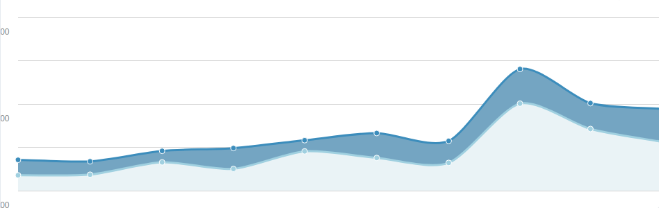

## List of components


### - [AreaChart](./charts/area-chart.js)

A basic Area Chart For displaying grouped sets of data points.

#### Usage:

Props: This component takes 6 values.

```javascript

id = 'chart' (A string signifying the unique id of the chart)
data = '{[{ xkey_string: 'Any String', ykey_string: 'Any Number'}]}' (Where xkey_string is a variable with the same verbatim name as string defined in xkey prop)
                                                                     (Where ykey_string is a variable with the same verbatim name as one of the strings defined in ykeys prop)
xkey = 'Any Unique String' 
ykeys =  ['Any Unique String', 'Any Unique String']
labels = ['A String', 'A String'], (Directly Correlational to ykeys index)
lineColors = ['A Hex Color', 'A Hex Color'], (Directly Correlational to ykeys index)

```
#### Example: 

```javascript
<AreaChart 
    id="revenue-chart"
    data = {[
        {y: '2011 Q1', item1: 2666, item2: 2666},
        {y: '2011 Q2', item1: 2778, item2: 2294},
        {y: '2011 Q3', item1: 4912, item2: 1969},
        {y: '2011 Q4', item1: 3767, item2: 3597},
        {y: '2012 Q1', item1: 6810, item2: 1914},
        {y: '2012 Q2', item1: 5670, item2: 4293},
        {y: '2012 Q3', item1: 4820, item2: 3795},
        {y: '2012 Q4', item1: 15073, item2: 5967},
        {y: '2013 Q1', item1: 10687, item2: 4460},
        {y: '2013 Q2', item1: 8432, item2: 5713}
    ]}
    xkey= 'y'
    ykeys= {['item1', 'item2']}
    labels= {['Item 1', 'Item 2']}
    lineColors= {['#a0d0e0', '#3c8dbc']} />
```


